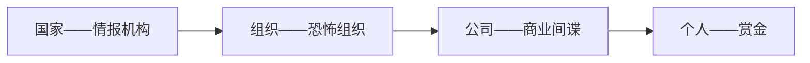

### Lec 1

- 分数组成
  - 课堂 — — — 10pts
  - 作业 — — — 40pts
  - 考试 — — — 50pts

- 杂谈
  - 永远不会有绝对安全的系统——除非你把电脑砸了
  - 社会工程学表明大多数人在不同平台倾向于使用相同的密码
  - 尽量用不同的密码
  - 一个系统的安全性是cost-benefit平衡的
  - 不要觉得个人设备黑客不感兴趣，大多数都是围绕着钱

- 回答问题「5/10」（尽量靠前做）
  - 2026.3.2  （1）
  - 2026.3.4  （1）
  - 2026.3.9  （2）
  - 2026.3.11 （1）