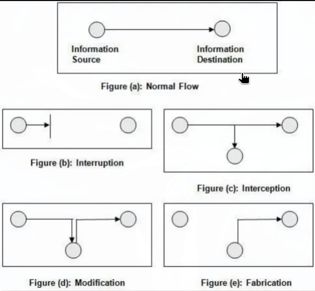

## Lec 3 信息安全
#### 2026.3.9

### computer security的重要性
- PC 时代
  - 电脑病毒横行（软盘传播）
  - 主要是炫耀和破坏
  - CIH病毒破坏BIOS系统导致无法开机，必须更换电脑主板芯片
- 互联网时代
  - 黑客，蠕虫，木马，DOS攻击，僵尸网络
  - 蠕虫：感染电脑之后利用互联网联系感染连接的电脑，即使不造成损失，但发包导致网络带宽被占用，间接造成大量经济损失
  - 木马：利用系统漏洞，伪装欺骗电脑，窃取数据和持久控制
  - 主要为了获利
- 后互联网时代
  - 互联网成了每个人生活的一部分
  - 国家，公司，组织开始有预谋有计划的防止和利用信息安全漏洞

### 计算机安全的独特之处
- 我们无法分辨计算机的原件和复印件
- 修改，摧毁 计算机信息十分容易
  - 纸质信息小贴士：谨慎签名，（空白页注：此页空白）

### 计算机安全的概念
- 资产(Assest)
- 威胁(Threat)
  - 方法上：自然灾害；物理手段；硬件/软件；媒体；泄露；通讯；个人行为
  - 意愿上：有意；无意
- 漏洞(Vlnerability)
- 风险(Risk)
- $A+T+V=R$

- 安全攻击的分类
  - Interruption：An asset of a system is destroyed, unavailable, orunusable
    - 攻击“Availability”
  - Interception：An unauthorized party gains access to an asset
    - 攻击“Confidentiality”
  - Modification：Unauthorized parties gain access as well as tamper with asset
    - 攻击“Integrity”
  - Fabrication：An unauthorized party inserts counterfeit (fake) objects into thesystem and pretends an authorized party sent them
    - 攻击“Authentication”
  - 图示
  - 
  - 分类：
  - 第一个属于passive attack 
    - 检测难度：难
  - 其余属于active attack
    - 检测难度：易

- 对抗安全威胁的目标
  - 30%靠技术，70%靠管理
  - 预防
  - 探测 —— 设计阈值
  - 恢复（更高级的策略是攻击发生时依旧正常运作）

- 安全策略（policy）和安全机制（mechanism）
  - 策略指出什么行为被允许，什么应当被禁止
  - 机制强制执行策略
  - 策略的组合可能也会导致安全故障

- 安全服务
  - Authentication
  - Access control
  - Data Confidentiality
  - Data Integrity
  - Non-Repudiation
  - Availability

- 行动事项
  - 本利平衡
  - 风险风险
  - 法律和本地习惯

- 人类事项
  - 组织上的问题
    - 权利与责任
    - 获利
  - 人会犯错
    - 主动：内鬼
    - 被动：粗心大意