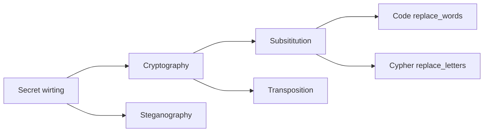

## Lec 3 密码学，历史与概念
#### 2026.3.11

### 密码学（crypotography）基础
- 秘写与隐写

- 术语
  - P（plain text）；C（ciphertext）
  - E（Encryption）；D（Decryption）
  - K（key）
  - $C=E_K(P)$
  - $P=D_K(C)$

- 加密方法
  - subsititution
  - transposition

- 解密
  - 已知的信息
  - 分析的结果 

### 密码的历史
- **第一阶段**
  - 缠带加密
  - 古希腊密码（二战也用）
  - 凯撒密码
  - 玛丽女王的密码

- 这些密码都是**单表替代密码**（Monoaplphabetic Subsititution Cipher）
- 这些可以用**频率分析**破解
- 为了对抗频率分析，发明了 Vigenère Square （！没有密钥，加一个DEFCON）
- 这是一种 Polyalphabetic Subsititution Cipher
- 如何破解 Vigenère？
- 寻找连续重复，确定唯一的循环周期，再对周期中的每一个进行频率分析

- 用书加密
  - 例子：豪密 用书第几页第几行第几个字指代一个word

- **第二阶段**
  - 机械加密：Enigma

- 二战时期德军使用的复杂加密工具，是多表替代密码的巅峰之作

* **核心组件**：
    * **键盘与灯板**：输入与显示。
    * **接线板 (Plugboard)**：提供巨大的密钥空间，允许成对交换字母。
    * **转子 (Rotors)**：核心加密单元，每按一个键转子就会旋转，改变电路路径。
    * **反射器 (Reflector)**：使信号折返，保证了加密和解密操作的完全对称性。

### Enigma 的破译历程
1.  **波兰突破 (Marian Rejewski)**：
    * 利用德军操作失误（重复输入消息密钥）发现“模式”。
    * 通过数学方法分离出接线板的影响，专注破解转子配置。
2.  **英国终结 (Alan Turing)**：
    * **已知明文攻击 (Cribs)**：利用德军电报中固定的短语（如天气预报词汇）作为突破口。
    * **Bombe 机器**：图灵设计的机电装置，通过逻辑排查快速搜索转子设置。

### 3.3 历史启示
* **失败原因**：
    1.  **人为误用 (Misuse)**：重复产生模式。
    2.  **设计盲点**：虽然接线板增加了组合数，但在数学建模下仍有逻辑漏洞。
* **破译算法的一般路径**：
    * 寻找**模式 (Patterns)**。
    * 降低**复杂度/维度 (Complexity/Dimensions)**。
    * **暴力破解 (Brute-force)**。
    * 深厚的**数学背景**与**运气**。