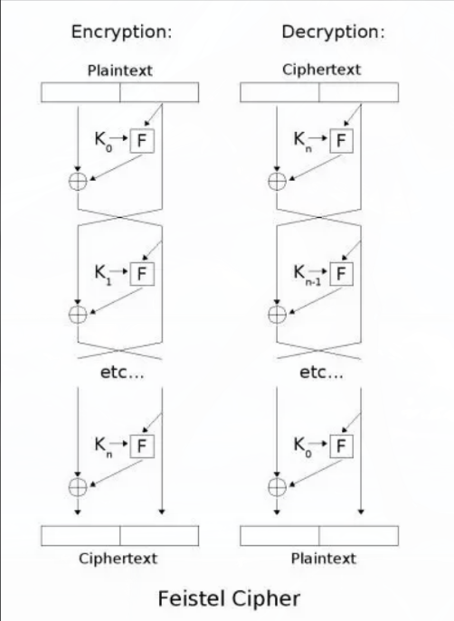

## Lec 5 对称与非对称密码学
#### 2026.3.16

### 密码学第三阶段
- 计算机时代来临
- 密码学进入（非）对称加密时代
- Symmetric Key Cryptography
  - share（共享）； secure（保密）
  - 模式图
  - 两种方法： stream cipher； block cipher

- 案例
  - Feistel Cipher Structure
  - 两个设计理念 
    - Diffusion：密文的统计特性与明文之间的关系尽可能复杂
    - 
    - Confusion：密文的统计特性与加密密钥之间的关系尽可能复杂
    - **round function F**
  - DES (Data Encryption Standard): 曾经的标准，采用 Feistel 网络结构，但因 56 位密钥过短，现已**不安全**
  - 3DES: 对 DES 的改进，通过三次加密提高安全性，**效率低**
  - AES (Advanced Encryption Standard): 目前的行业标准，支持 128/192/256 位密钥，效率高且极其安全

- block cipher（块间加密）
  - 不使用块间加密容易导致，攻击者很容易更换密文，造成攻击
  - 常用类型：CBC； PCBC； CFB； OFB

- Stream Cipher（流加密）
  - 