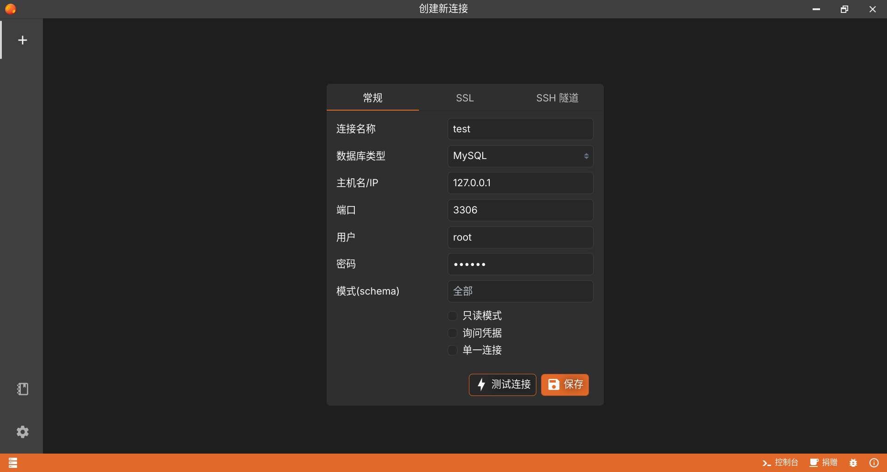
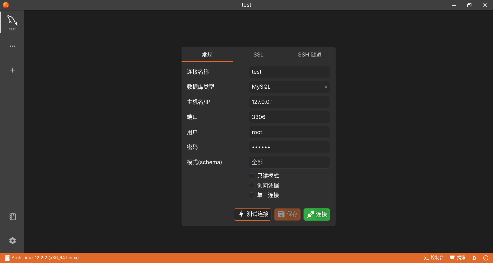
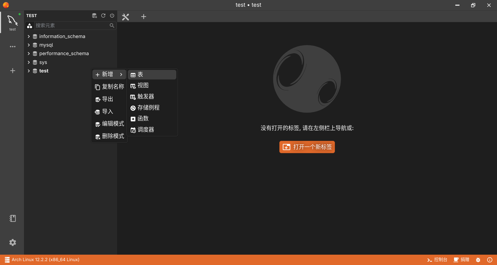
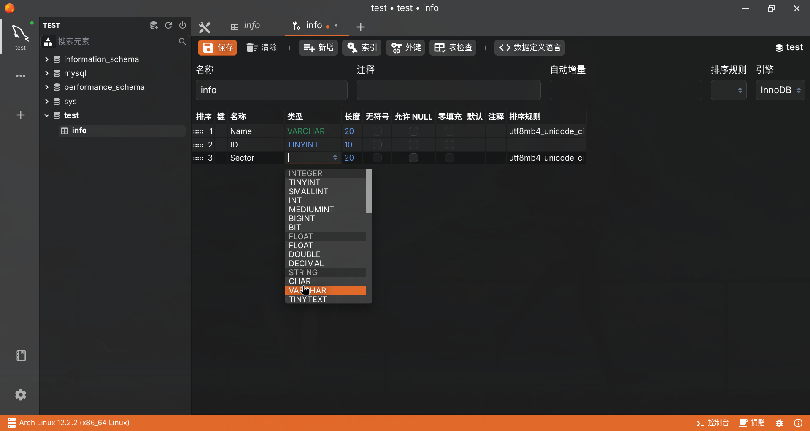
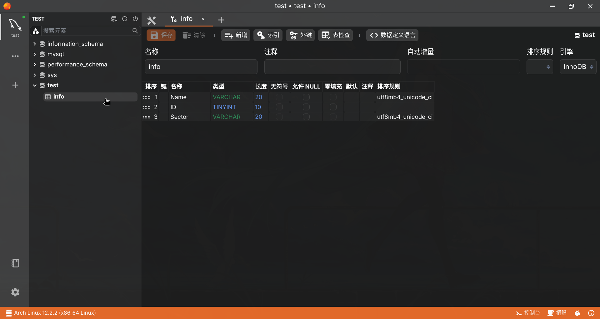
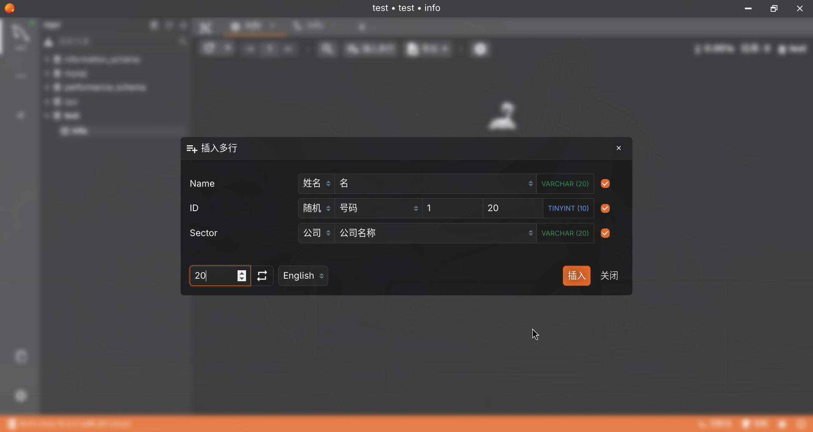
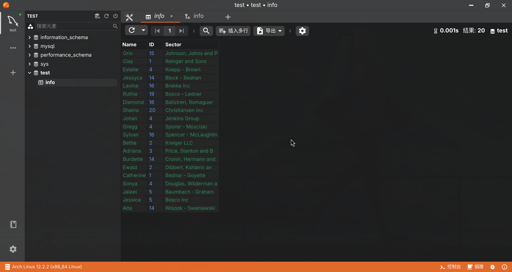

实验1 DBMS的安装和使用

### 实验目的
1. 通过安装某个数据库管理系统，初步了解 DBMS 的运行环境。
2. 了解 DBMS 交互界面、图形界面和系统管理工具的使用。
3. 搭建实验平台。

### 实验平台
1. 操作系统： ArchLinux
2. 数据库管理系统： Antares SQL

### 实验步骤
1. 安装 Antares SQL
2. 建立连接和账户密码

    - 数据库类型默认MySQL
    - 补全连接名称和密码即可
3. 创建表
   1. 连接数据库

   2. 选择 test，右键新建表

   3. 添加字段并双击修改，最后写上table名称保存

   4. 点击左侧新建的表进入视图

   5. 插入多行，设置如图
 
   6. 效果如图
